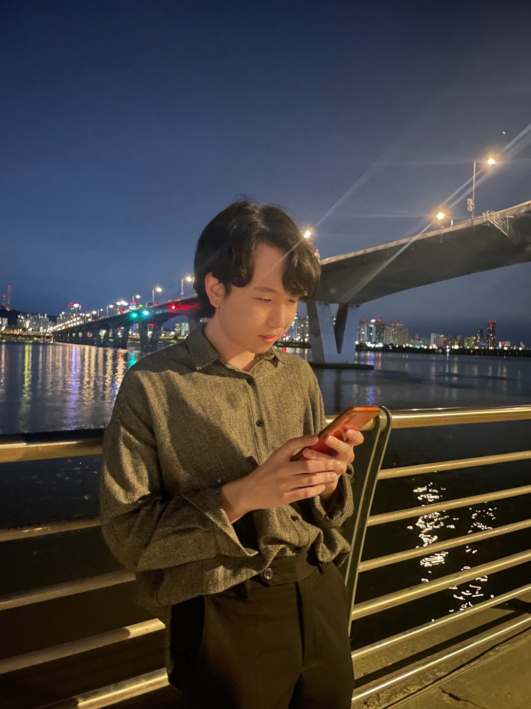

<h1 align = "center"> WELCOME TO SANGHUN'S WEB PAGE </h1>

 

I am an undergraduate research intern of [Human-Centered Artifical Intelligence Lab](https://hcail.uos.ac.kr/)(HCAIL).  
Also, I am a third-year student in [computer science department and Engineering](https://engineering.uos.ac.kr/engineering/index.do?cate_id2=000010383&epTicket=INV) at [University of Seoul](https://www.uos.ac.kr/main.do?epTicket=INV#n).  

---
## Contact

 <strong>phone</strong> : +82 10-4511-0462  

 <strong>e-mail</strong> : 507408gh@gmail.com  

 <strong>twitter</strong> : [@ksh991014](https://twitter.com/ksh991014)  

 <strong>linkedin</strong> : [김상훈](https://www.linkedin.com/in/%EC%83%81%ED%9B%88-%EA%B9%80-9006bb260/)  

---
## Education

**University of Seoul**

March 2019 - Present
  
- Undergraduate student in  Department of Computer Science & Engineering  
- Expected graduation date - February 2025

---
## Experience

**Human-Centered Artificial Intelligence Lab**

January 2023 – Present 
  
- Supervisor: Prof. [Hyunggu Jung](http://hyunggujung.com/index.html)  
- Undergraduate Research Intern

---
## Resume

[check Resume](resume_2.pdf)
